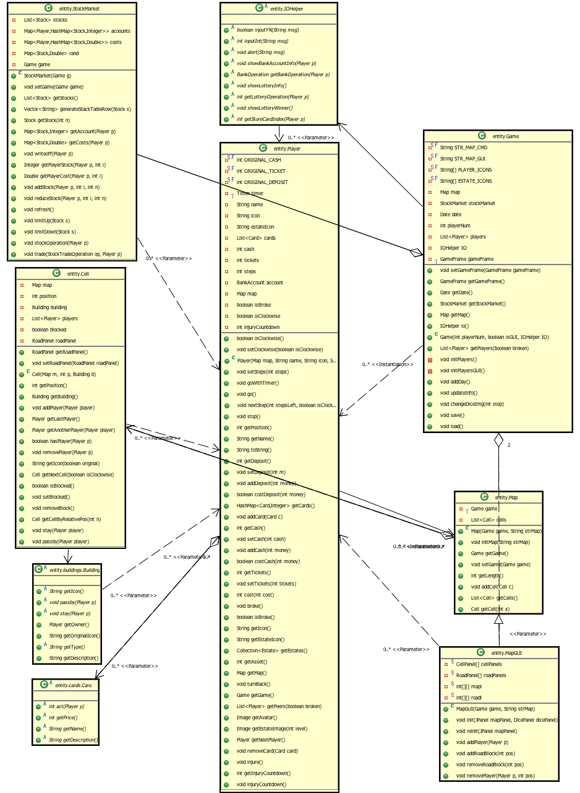
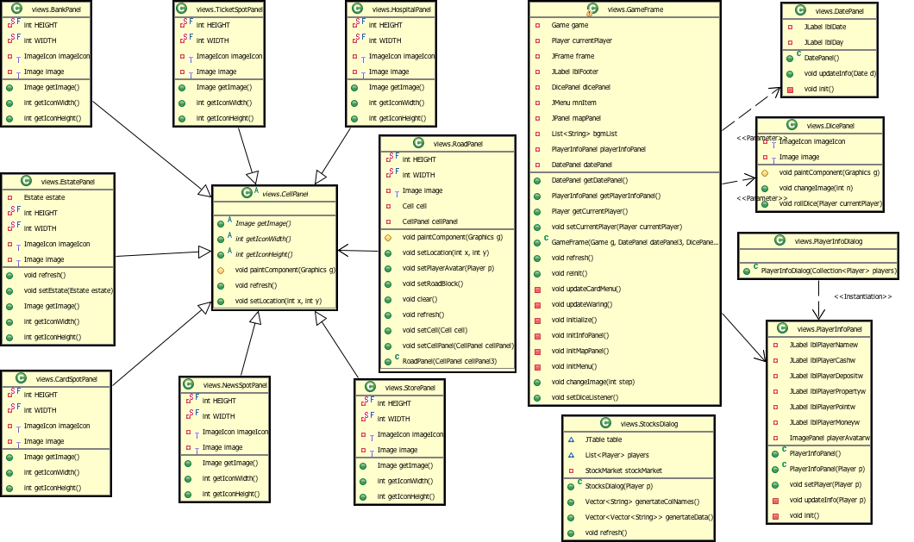
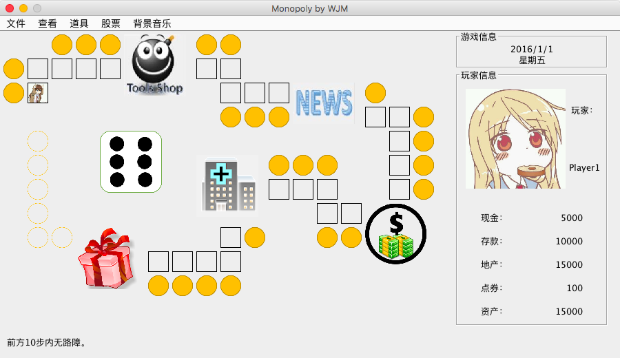
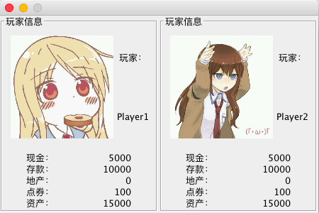
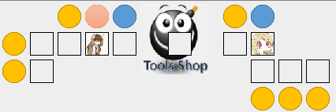

## 面向对象设计

在本次project中，我将模型和视图彻底分离，所以Part 2在Part 1的基础上并不需要对模型部分做很大改动，只需要在视图部分加入图形界面即可。

IO部分通过用IOHelper_cmdLine和IOHelper_GUI继承抽象的IOHelper类（见图一）来实现。这样只要调用IOHelper的方法就可以实现IO，而不用在意具体的实现方式是命令行还是图形界面。




<center>图1 模型的UML类图</center>




<center>图2 视图的UML类图</center>


1. 图形界面的设计以及相关截图

   

   <center>图3 图形界面（对应GameFrame类）</center>

   ​	游戏界面位于GameFrame类（见图二）中，其中包括上方的菜单栏，左侧的地图面板、右侧的游戏信息、玩家信息面板和下方的提示信息（采用BorderLayout）。

   ​

    

   <center>图4 玩家信息对话框（对应PlayerInfoDialog类）</center>

   ​	玩家信息对话框位于PlayerInfoDialog类（见图二）中，其中玩家信息的显示与主界面中相同（采用GridLayout）。

   ```java
   /* PlayerInfoDialog类的构造函数 */
   public PlayerInfoDialog(Collection<Player> players) {

   		this.setBounds(100, 100, 225 * players.size(), 300);
   		this.setLayout(new GridLayout(1, players.size(), 0, 0));

   		players.forEach(p -> {
             	// PlayerInfoPanel与主界面中的玩家信息相同
   			this.add(new PlayerInfoPanel(p));
   		});

   		this.setResizable(false);
   }
   ```

    

   <center>图5 股票交易对话框</center>

   ​	股票交易对话框位于StocksDialog类（见图二）中，其中包含一个表格（JTable）。由于JTable的默认model是可以单元格内容更改的，所以我用StocksTableModel类继承DefaultTableModel，将单元格设为不可更改。在这里我还使用了几个辅助方法用于从`HashMap<Player, HashMap<Stock, Integer>>`类型的股票账户生成表格的内容（`Vector<Vector<String>>`）。

   ```java
   /* StocksDialog类的构造函数 */
   public StocksDialog(Player p) {
     Game g = p.getGame();
     players = g.getPlayers(true);
     stockMarket = g.getStockMarket();
     table = new JTable();
     JScrollPane sp = new JScrollPane(table);
     
     // 添加股票选择监听器
     table.getSelectionModel().addListSelectionListener(new 						ListSelectionListener() {
       @Override
       public void valueChanged(ListSelectionEvent e) {
         int index = ((ListSelectionModel) e.getSource()).getMinSelectionIndex();
         if (index != -1) {
           StockTradeOperation op = ((IOHelper_GUI) 										g.io()).inputStockOp(stockMarket.getStock(index + 1));
           stockMarket.trade(op, p);
           // 刷新股票信息
           refresh();
         }
       }
     });
     this.refresh();
     this.add(sp);
     this.setTitle("股票交易");
     this.setSize(800, 300);
     this.setResizable(false);
     this.setVisible(true);
   }
   ```

   ​

2. 代码改动部分以及新增部分说明

   - 包结构重构。原来所有实体都直接在entity包下；现在将建筑物实体移至entity.buildings包下，卡片实体移至entity.cards包下。新增views包，用于放置图形界面相关类。
   - 添加了新的实体类，如医院、查税卡、转向卡等。
   - 添加了GUI版本的Main方法，IOHelper_GUI类、以及图形界面相关类（见图二）——包括GameFrame（游戏主界面）、PlayerInfoDialog等对话框以及各种面板（Panel）如地图上的建筑物以及道路、玩家信息面板等。（部分代码实现见上一部分）

   ​

3. 经过这次扩展,你是否发现你之前的设计有缺陷或者不足?可以如何修改?

   ​	虽然在做Part 1的时候就想过了IO要和实体分离，但是做的还不够彻底：部分逻辑稍有些复杂的IO操作仍然存在于实体类当中。在Part 2的编写中，我将这部分复杂的IO操作也抽象提取至IOHelper类中，实现了更彻底的分离。

   ​

## 遇到的难题

​	这次遇到的难题主要是图形界面上Component的重绘问题。由于`void java.awt.Component.repaint()`只是是发出重绘请求，等待awt线程选择合适的时间进行重绘，所以通常情况下它是不会立即执行的。这时如果多个组件需要重绘，执行的顺序是不可控的。所以可能会出现如下情况：

 <center></center>

​	先后在RoadPanel和BuildingPanel上调用`repaint()`，但BuildingPanel重绘却先于RoadPanel，导致BuildingPanel上出现了一块“残影”。

​	我的解决办法是`repaint()`替换为`paintImmediately(int, int, int, int)`，立即重绘这片区域。 