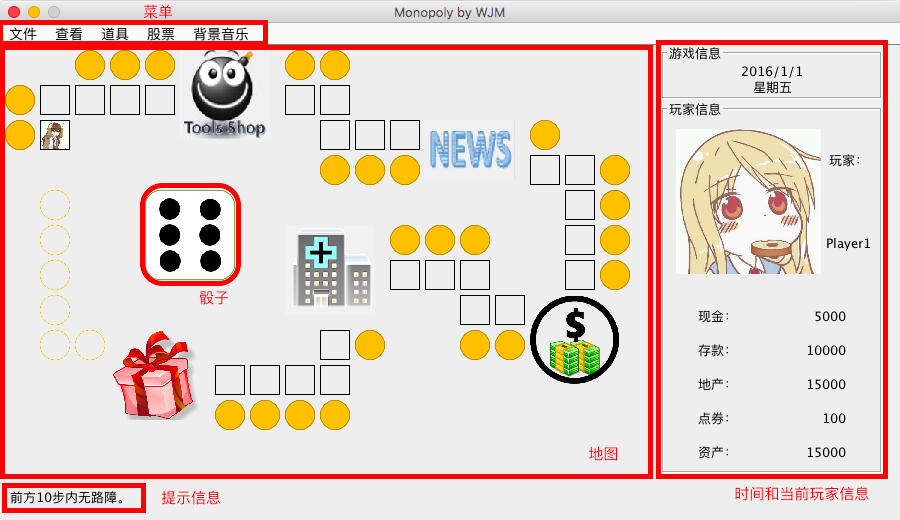
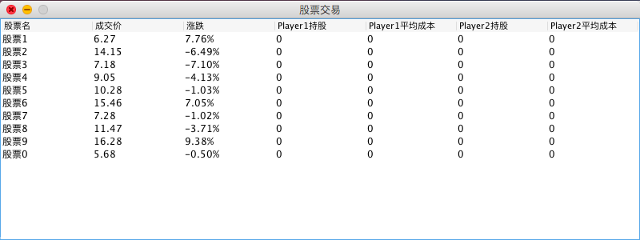

## 界面说明

主界面由菜单、地图、骰子、时间和当前玩家信息以及提示信息组成。

- 菜单

  游戏菜单分为5个子菜单，分别为文件、查看、道具、股票和背景音乐。

  - 文件

    文件子菜单下有保存游戏、读取游戏、退出游戏三个菜单项。点击保存游戏可以保存游戏当前进度到指定文件；点击读取游戏可以读取保存的进度；点击退出游戏会直接退出程序。

  - 查看

    查看子菜单下有查看玩家信息和指定地点过路费两个菜单项。点击查看玩家信息可以查看所有玩家的当前信息，内容与主界面上的玩家信息相同。点击指定地点通过输入与当前玩家的相对位置（正数为顺时针方向、负数为逆时针方向、0为当前地点）查看地点信息。

  - 道具

    道具子菜单下是当前玩家拥有的所有卡片。点击卡片名称即可使用。

  - 股票

    股票子菜单下只有一个进入股票交易菜单项，点击即可进入股票交易。 

    点击股票所在行上任意单元格即可进行该股票的交易。

  - 背景音乐

    目前有两首背景音乐可供选择，点击即可播放。

- 地图

  地图区域包含当前游戏的地图。每一格的详细信息可以通过菜单－查看－指定地点来查看。玩家所在位置由其头像表示。

- 骰子

  点击骰子即可投掷骰子。根据投掷出的点数前进。

- 时间和当前玩家信息

  显示当前游戏的日期以及当前玩家的信息。

## 游戏说明

​	Monopoly(大富翁)是一个以经营为主的棋类游戏。您的目标是通过各种方法（主要是购买土地收取过路费）让对手破产。

​	打开运行本程序即开始新游戏。本游戏为回合制（一回合为一天），每位玩家每回合有一次投掷骰子的机会，投掷完毕并行走相应步数后即轮到下一玩家。当所以玩家都行动过之后，本回合结束，进入下一天。在投掷骰子之前，玩家可以使用道具（卡片）以及进行股票交易，也可以查看各种信息。

## 如何运行

- 双击运行monopoly.jar

​	Note: 请保证bgm与image文件夹与monopoly.jar在同一目录下
